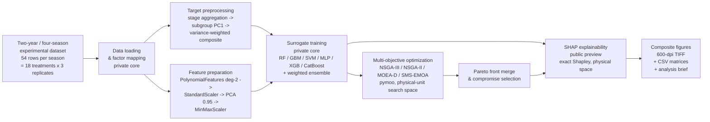

# System Architecture

## Pipeline overview



## Module responsibilities

| Layer | Module | Availability | Responsibility |
|---|---|---|---|
| Data | `data_loader.py` | private | Season registry loading, factor-code → physical-value mapping (PPFD / AvgTemp / ET), target-group column registry |
| Data | `data_preprocessor.py` | private | Missing-value imputation, stage aggregation (PCA per base indicator), subgroup PC1 aggregation, variance-weighted quality score, feature space preparation |
| Model | `models.py` | private | Seven surrogate learners + weighted ensemble; repeated-level leave-one-replicate CV; treatment-extrapolation and mean-memory-baseline controls; full-data final retraining; artifact persistence (models + preprocessing chain + ensemble weights) |
| Optimize | `optimizer.py` | private | pymoo problem wrapping the surrogate prediction chain; physical-unit bounds; solution caching; front merging; hypervolume / spread / spacing metrics |
| Orchestrate | `main.py` | private | Season loop: preprocessing → training → 4-algorithm comparison → merge → reports (Chinese + English) → persistence |
| Visualize | `sci_visualization.py` | **public** | SCI-journal figure factory (Times-serif theme, 2×2 composites, 3-D Pareto fronts, radar / parallel coordinates / heatmaps) |
| Explain | `shap_analysis.py` | **public** | Exact SHAP attribution with gold-standard chain verification |
| Share | `utils.py` | **public** | Conda DLL self-check, global 600-dpi TIFF savefig redirection, dual-channel logging |

## The surrogate prediction chain

The optimizer evaluates candidate climates through a single prediction chain that all
downstream analyses must reproduce exactly:

```
raw physical inputs (PPFD, °C, ETc)
  → PolynomialFeatures(degree=2, include_bias=False)      # 3 -> 9 features
  → StandardScaler                                        # fitted on the 54 measured rows
  → PCA(n_components=0.95)                                # 3 components, ~99.5% variance
  → MinMaxScaler                                          # per-component [0, 1]
  → StandardScaler                                        # fitted on the final retraining set
  → weighted tree-ensemble prediction                     # clip to [0, 1]
```

Two rules keep every consumer aligned with this chain:

1. **Artifacts are self-describing.** After training, the full chain (all scalers, the
   polynomial transformer, the PCA, the ensemble weights) is persisted next to the
   model objects, so offline analyses load the exact fitted objects instead of
   re-deriving them.
2. **Anything not persisted is reconstructed under the runtime regime.** Legacy
   artifacts predate chain persistence; for those, the chain is rebuilt
   deterministically from the measured data, and whether the final retraining set was
   augmented is adjudicated from the runtime log (retrained sample count), never from
   configuration intent — configuration can drift from what actually executed.

## Gold-standard verification before attribution

SHAP attributions are only produced after two gates pass:

1. **Anchor gate** — the reconstructed augmentation set size must equal the sample
   count recorded in the runtime log for that season (e.g. 272 = 54 raw + noise /
   mixup / boundary-extrapolation replicas).
2. **Front-reproduction gate (primary)** — feeding the saved Pareto-front decision
   variables through the reconstructed chain and ensemble weights must reproduce the
   saved front objectives with `max|Δ| = 0.0` (float-exact; the optimizer adds ~1e-6
   diversity noise, so the gate allows 1e-3). This gate is y-free: it validates the
   entire chain + weights end-to-end against artifacts the optimizer itself produced.

A diagnostic (non-blocking) check re-computes `final_train_r2` on the retraining set
and compares it with the logged anchor; deviations indicate that the target
re-construction drifted from the historical run, which does not affect SHAP
correctness because SHAP depends only on the verified prediction function.

## Why exact Shapley in the physical space?

The model-input space is a PCA embedding of degree-2 polynomial features — accurate but
not agronomically interpretable. Because the study has exactly three environmental
drivers, `shap.Explainer(..., algorithm='exact')` enumerates all 2³ coalitions of the
**full pipeline** (preprocessing chain + ensemble), yielding exact Shapley values in
PPFD / °C / ETc with additivity residuals at machine precision (~1e-15). No sampling
approximation is involved anywhere.

## Reproducibility notes

- Random seeds are fixed (42) for augmentation, Optuna sampling, and pymoo.
- The TIFF wrapper redirects every `savefig` in the process to 600-dpi lossless
  (deflate) TIFF with tight bounding boxes — no raster `.png` side products.
- On Windows/conda, a fail-fast DLL path self-check runs before the first C-extension
  import to avoid silent `KERNELBASE.dll` crashes from missing `Library/bin` on `PATH`.
